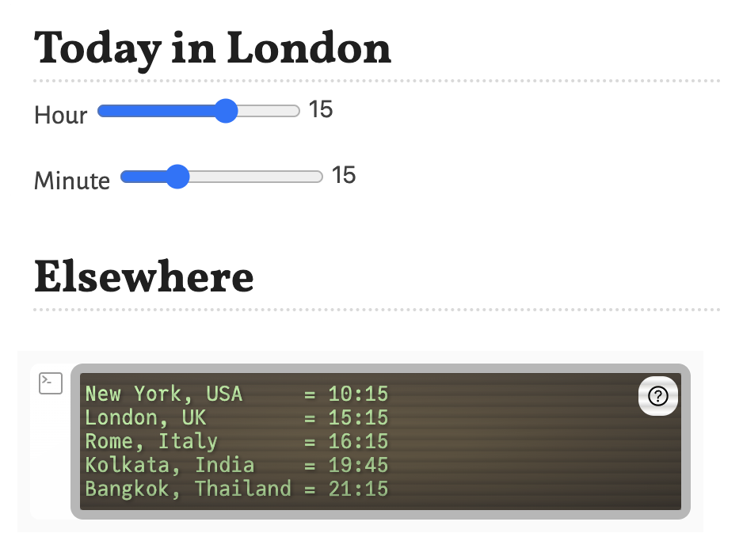

# TimeZones
Simple Pluto.jl based timezone converter to help with meeting scheduling

To start Pluto.jl use the following

```julia
import Pluto; Pluto.run()
```

then you can open the `TimeZones.jl` notebook.

The default time is the current time in London. Edit the cells if you want different time zones or additional functionality.

Here's an example screenshot of the notebook.

